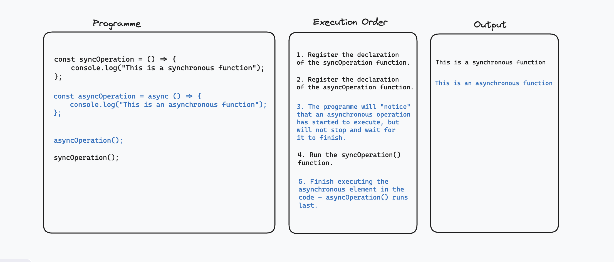
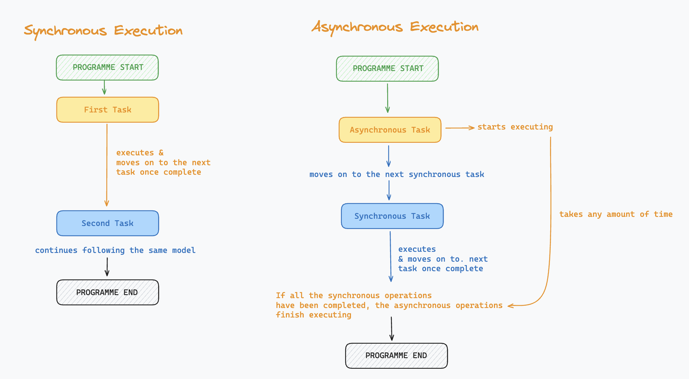

# Asynchronicity in Javascript: 

### Synchronous Code:

Code runs in a controlled sequence, called the **execution order**. For instance, this snippet of code would run in the order it was written, from top to bottom:

```
const countSheep = (sheepArray) => {
    return sheepArray.length;
}

const sheep = ["Bramble", "Daffodil", "Buttercup"];

const sheepAmount = countSheep(sheep);

console.log(sheepAmount);
```

The execution order of this programme would be as follows: 

1. Declaration and assignation of the function ```countSheep```
1. Declaration and assignation of the variable ```sheeps```
1. Call the ```countSheep()``` function with the argument ```sheeps``` and saves the return value in ```const sheepAmount```. 
1. Call the ```console.log()``` function on the sheepAmount variable, printing 3 to the console. 

<br>

If we had tried to call the function ```countSheep``` before it was declared, we would have ran into a bug due to the top to bottom execution order - as far as our programme is concerned, a variable only exists if it has been declared before being used. 

This is typical behaviour, and an example of **synchronous code** - operations are executed one at a time, from top to bottom. The next operation can only run once the one before has finished executing. 

### JavaScript is a single-threaded language:

JavaScript is what we call a **single-threaded language**. This means that it can only run one thing at a time, and can only start executing the next operation in the programme once the first task has completed. Multi-threaded languages can support more than one operation all at once, but that's not the case with JavaScript.

Given that JavaScript is used in web browsers, that typically need to be able to run many operations all at once, this comes with a set of challenges. Some of the operations that we need to perform for the web **will take an unpredictable amount of time to run**. 

For instance, when making calls to servers, **you cannot know how long it will take to get a response**, as that depends on a number of factors, including the speed of your internet. 

Imagine what would happen if our browsers were only able to send one request at a time and had to wait for a response before moving on to the next one! For example, when loading the reddit homepage, there's about 266 operations executing to get all the data needed to render everything on the page - if these had to be run one by one by one, some slower than other, you can picture just how slow and frustrating loading any given page would be. JavaScript's single thread of execution would end up "blocked" by long-running operations, unable to go ahead and run the next one before the one prior finished executing.

Enter **asynchronous JavaScript** - asynchronous JavaScript seemingly lets you run more than one operation concurrently, dealing efficiently with these long-running tasks. 

Here's a video illustration of these principles: 
[video here]

### Asynchronous JavaScript: 

As seen above, long-running operations can have a significant impact on how our programmes runs - what if, for example, I need to somehow "wait" for some data from an external server before I can perform a particular task, such as displaying data on a web page? What happens if asynchronous code is mixed in with synchronous code that executes in the typical way, from top to bottom? Let's examine a few different scenarios to answer these questions. 

The first rule that we will see is that, when synchronous code and asynchronous code are mixed together, **there will be no "pausing and waiting" for asynchronous code to finish running before the rest of the synchronous code executes**. 
Instead, the programme will run as usual, executing from top to bottom, "register" the asynchronous operations, but move on to the next synchronous block. The asynchronous code will finish executing only after all of the synchronous operations have run.



Here is a video to show you how this principle in action, comparing synchronous and asynchronous code executing: 

[video needs to go here]

### One step further: 

To summarise the above, here is a schema of the difference between synchronous and asynchronous execution in JavaScript.

<br>



If you want to go one step further and understand what's happening to the asynchronous operations when the programme seemingly "skips" ahead and executes the rest of the code, you can watch this video for a great concise explanation of how JavaScript handles this in the background: 

<iframe width="560" height="315" src="https://www.youtube.com/embed/lqLSNG_79lI?si=uDdGAS9UL4Ih0cnS" title="YouTube video player" frameborder="0" allow="accelerometer; autoplay; clipboard-write; encrypted-media; gyroscope; picture-in-picture; web-share" referrerpolicy="strict-origin-when-cross-origin" allowfullscreen></iframe>


