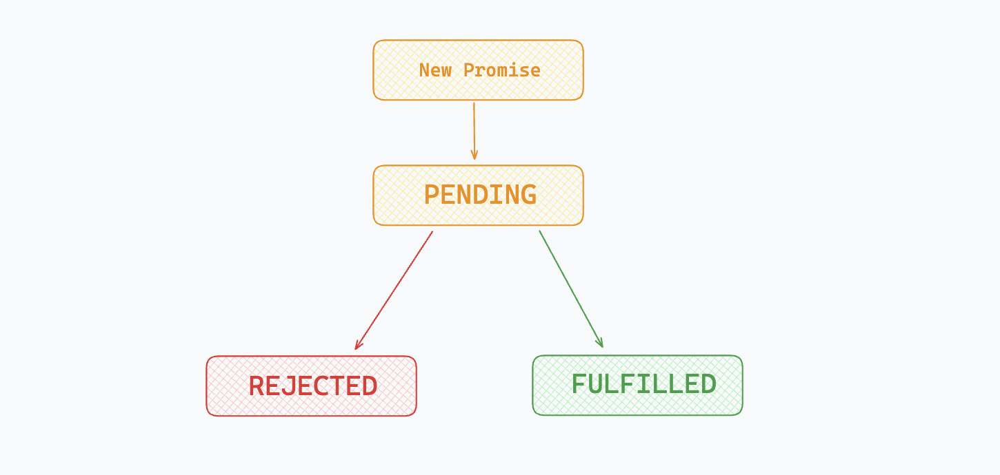
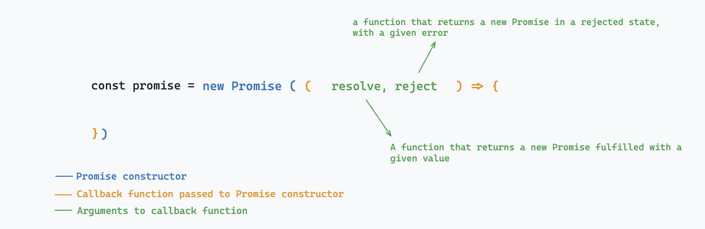
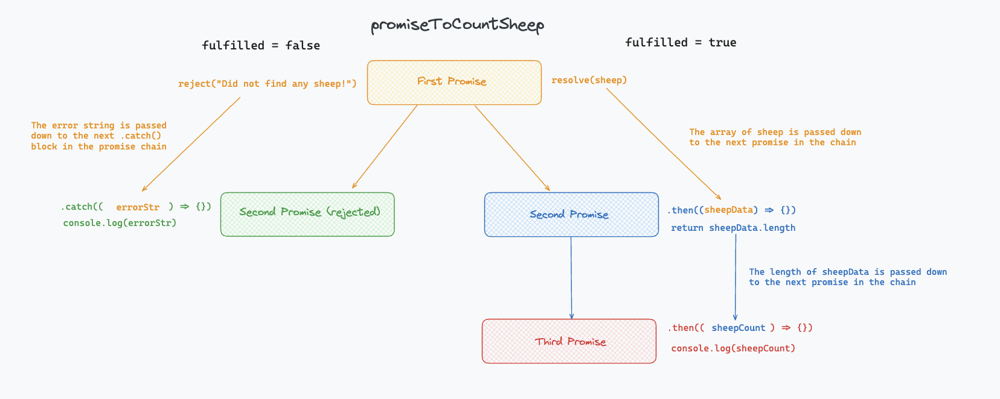

### Promises:

Promises are a feature of JavaScript that we use to handle this asynchronicity problem and regain control over the execution flow of our programme. Promises let you control the order in which some operations will run in your code - for example, if some of your code depends on data coming from an external server, using promises will let you run these operations once you have received the data.

Promises are **objects** - you can think of them as containers for future data, **a representation of the future completion or failure of an asynchronous operation**. As such, they have three different states: 

1. **Fulfilled** - *the asynchronous operation completed successfully* - for instance, the data you requested from an external server has come back with no isses. 

1. **Rejected** - *the asynchronous operation failed* - for instance, you sent an invalid request to a server, and it answered with an error.  

1. **Pending** - *the Promise has yet to to be either rejected or fulfilled.* - this is the lapse between sending a request and getting an answer back from your server. 

<br>



### Writing a promise from scratch: 

In order to create a new Promise, you need to use the ```new``` keyword that you would normally use to create an instance of a class in JavaScript. This is because promises are **an in-built class** that you can use as an when needed in a JavaScript programme. The Promise constructor takes one argument, a callback function with two arguments of its own, the two functions ```resolve``` and ```reject```:

<br>



<br>

```Resolve``` and ```Reject``` **each return a new promise**, potentially starting what we call a **promises chain**. Promises chains let you write code that will execute only once a particular asynchronous operation has ran, successfully or unsuccessfully (i.e. once a promise was either fulfilled or rejected). 

As promises are classes, **they come with their associated methods**. The most important methods to remember in the case of Promises are .```then()``` and ```.catch()```. These two methods will let you start building promises chains and handle errors when they arise.

For instance: 

```
const promise = new Promise((resolve, reject) => {

    resolve("This Promise will resolve with this success string.");

}).then((resolvedString) => {
    console.log(resolvedString);
});

---------------------------TERMINAL--------------------------
This Promise will resolve with this success string.
```

OR 

```
const promise = new Promise((resolve, reject) => {

    reject("This Promise will be rejected with this error string.");

}).catch((errorString) => {
    console.log(errorString);
});

---------------------------TERMINAL--------------------------
This Promise will be rejected with this error string.
```

<br>

In both cases, you can see that the methods ```.then()``` and ```.catch()``` have been called on the promise object above them in the chain, following the syntax ```promise.then(() => {})``` or ```promise.catch(() => {})```. To break it down further, we can note a few things:


1. ```.then()``` and ```.catch()``` each take a callback function as their argument. 

1. The argument of that callback function is the value the promise in the chain above was either resolved or rejected with. 

1. We can perform an operation inside of that callback function. This operation will only run once the promise above in the chain has finished executing. 

1. ```.then()``` handles situations where the promises was fulfilled (i.e. the asynchronous operation was successful), and ```.catch()``` situations where it was rejected. 

Here is a video run-through of the above[video here]

<br>

### Complex promises chains: 

<br>

Here is another example of a promise chain, this time, slightly more complex than the one in the example above:


```
const promiseToCountSheep = new Promise((resolve, reject) => {

    const fulfilled = true;
    const sheep = ["Bramble", "Daffodil", "Buttercup"];

    if (fulfilled) {
        resolve(sheep);
    } else {
        reject("Did not find any sheep!");
    }

}).then((sheepData) => {

    return sheepData.length;

}).then((sheepCount) => {

    console.log(sheepCount);

}).catch((errorStr) => {

    console.log(errorStr);

})

```

<br>

Reading the code above, spend a bit of time trying to guess how it works. Create a ```promisePlayground.js``` file and run it using the command ```node promisePlayground.js``` in your terminal.

1. Will all the ```.then()``` and ```.catch()``` blocks run one after the other, or will something else happen? Why? 

1. What does the .then() method return exactly? 

<br>
<details>
<summary> Extra questions (don't open until you solved the ones above, they'd spoil the answers for you!) </summary>

<br>

1. How would you get the ```.catch()``` block to run? Try to get it to execute in your playground file. 

1. Change the second promise in the chain to return the first sheep in the array alongside a fresh promise. Then, amend the next promise in the chain so that the names of the values available to you there reflect more adequately the data at hand. 

</details>

<br>


<details>
<summary> Answers & diagram summarising the example above </summary>

### Fulfilled is set to true - answers to question 1 & 2: 

If ```fulfilled``` is set to ```true```, then only the ```.then()``` blocks will execute. That's because the ```.catch()``` method only ever executes when a promise is rejected. When fulfilled is set to true, the first promise in the chain is **fulfilled** instead. Here, we have a bit of an artificial scenario, where I am fulfilling the first promise in the chain with a hard-coded array of sheep - in a real life examples the data might come from an API or a database. 

Then, the second promise on our chain can perform an operation with the sheep data. The code inside of this second promise will only ever run once the promise above it in the chain has resolved - this is very important, as for instance, if ```sheepData``` was undefined because an asynchronous database call hadn't completed, then my programme would throw an error such as *cannot read property .length of undefined*. Using the promise syntax here protects me from such issues. After that, the third promise on the chain prints the data on the console. 

In the code above, a new feature of the ```.then()``` method also becomes apparent - **it not only deals with the data coming from the promise above in the chain, but also returns a new promise itself.** You can also see that the promises in the chain below the first one don't need to use the ```resolve```function anymore, they can simply return data, and it will be passed down to the next promise in the chain. 

### Fulfilled is set to false - answer to extra question 1:

In order to get the ```.catch()``` block to execute, you should have set fulfilled to false. If ```fulfilled``` had been set to ```false```, a different scenario would have played out than the one described in the paragraph above. The ```reject``` function would have been called instead of the ```resolve``` one, and the programme would have skipped the ```.then()``` blocks entirely, calling instead the callback function inside of the ```.catch()``` block. 

This is useful in case something goes wrong when getting some data back from a server or a database - the ```.then()``` blocks depend on the data being correct, and would throw errors if they ran. Instead, skipping ahead to the ```catch()``` block will let you handle any errors as you please. In this case, we are just printing to the console what the error is, but in a real application, we could perform more complex operations, such as sending back http error statuses like 404 or 400. 


### Answer to extra question 2:

```
const promiseToCountSheep = new Promise((resolve, reject) => {

    const fulfilled = true;
    const sheep = ["Bramble", "Daffodil", "Buttercup"];

    if (fulfilled) {
        resolve(sheep);
    } else {
        reject("Did not find any sheep!");
    }

}).then((sheepData) => {

    return sheepData[0];

}).then((sheepName) => {
    // any naming around "sheep" works here :) 
    console.log(sheepName);

}).catch((errorStr) => {

    console.log(errorStr);

})

```

<br>

This diagram summarises how the promise chain above executes in both scenarios: 

<br>

  

</details>


</details>

[Here I need to record a video walkthrough of the above, will do that shortly]


//HERE - SOMETHING ABOUT HOW YOU'LL rarely write promises from scratch with the constructor, but might encounter them in the context of API calls, and fetch -> That will link to the next pill

### Challenges: 

<br>

**EXERCISE 1:**

```

const promiseToGatherFruit = new Promise((resolve, reject) => {

    const fruit = "Pineapple";

    resolve(fruit);

}).then((fruit) => {
    
    console.log(fruit);

});

```

<br>

1. Write some code to get the second promise in the chain to return a new promise that resolves with the length of the fruit string instead of simply logging the fruit string. Then, get this third promise to log the fruit string length to the terminal. 

<br>


**EXERCISE 2:**

```

const fruitArray = [];

const promiseToGatherFruit = new Promise((resolve, reject) => {

    const fruit = "Pineapple";

    resolve(fruit);

}).then((fruit) => {

    fruitArray.push(fruit);

});

console.log(fruitArray);

```

<br>

1. Predict what the output of the ```console.log(fruitArray)``` will be. Write a couple of sentences to explain your logic. 

<br>

**EXERCISE 3:**

```

const chopApples = () => {
    console.log("step 1 - chop apples and put them in a dish");
}

const mixCrumble = () => {
    console.log("step 2 - mix butter, sugar and flour until crumbly, spread over the apples")
}

const bakeCrumble = () => {
    return new Promise((resolve, reject) => {
        const burnt = false;

        if( burnt ) {
            reject("error - Oh no, burnt crumble!");
        } else {
            resolve("step 3 - Perfect golden crumble!");
        }

    }).then(( bakedCrumble ) => {

        console.log(bakedCrumble);

    }).catch(( burntCrumbleErr ) => {

        console.log(burntCrumbleErr);

    });
}

const enjoyCrumble = () => {
    console.log("step 4 - Delicious crumble - even better with custard!")
}

const makeCrumble = () => {
    chopApples();
    mixCrumble();
    bakeCrumble();
    enjoyCrumble();
}


---------------------
CURRENT OUTPUT:
step 1 - chop apples and put them in a dish
step 2 - mix butter, sugar and flour until crumbly, spread over the apples
step 4 - Delicious crumble - even better with custard!
step 3 - Perfect golden crumble!

```

<br>

1. Why is the output on the console in the wrong order? Why does step 4 currently happen before step 3? 

1. Fix the code above so that step 3 and step 4 are in the right order. 

