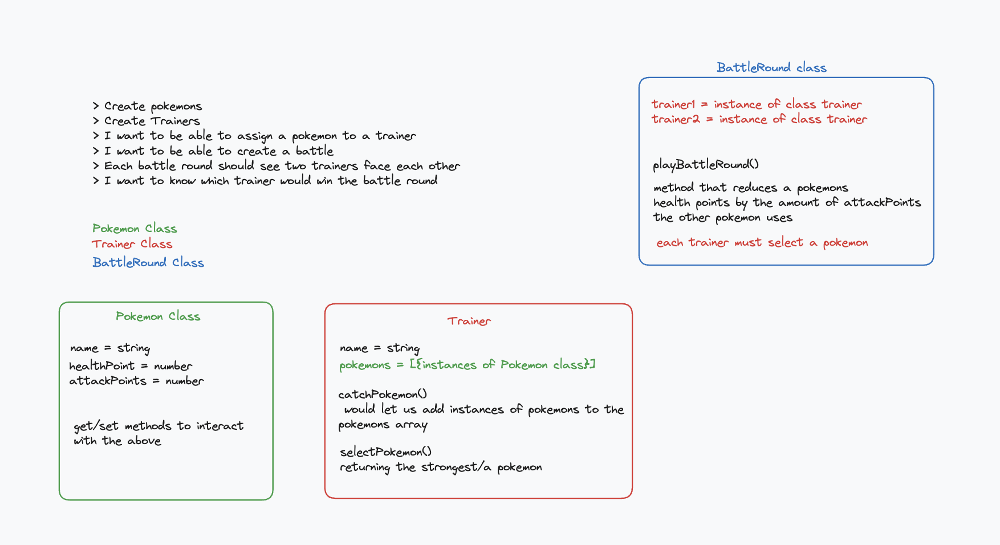

### Promises:

Promises are a feature of JavaScript that we use to handle this asynchronicity problem and regain control over the execution flow of our programme. Promises let you control the order in which some operations will run in your code - for example, if some of your code depends on data coming from an external server, using promises will let you run these operations once you have received the data.

Promises are **objects in-built in JavaScript** - you can think of them as containers for future data, **a representation of the future completion or failure of an asynchronous operation**. As such, they have three different states: 

1. **Fulfilled** - *the asynchronous operation completed successfully* - for instance, the data you requested from an external server has come back with no isses. 

1. **Rejected** - *the asynchronous operation failed* - for instance, you sent an invalid request to a server, and it answered with an error.  

1. **Pending** - *the Promise has yet to to be either rejected or fulfilled.* - this is the lapse between sending a request and getting an answer back from your server. 

<br>


### Writing a promise from scratch: 

In order to create a new Promise, you need to use the ```new``` keyword that you would normally use to create an instance of a class in JavaScript. This is because promises are **an in-built class** that you can use as an when needed in a JavaScript programme. The Promise constructor takes one argument, a callback function with two arguments of its own, the two functions ```resolve``` and ```reject```:

<br>


<br>

```Resolve``` and ```Reject``` **each return a new promise**, potentially starting what we call a **promises chain**. Promises chains let you write code that will execute only once a particular asynchronous operation has ran, successfully or unsuccessfully (i.e. once a promise was either fulfilled or rejected). 

As promises are classes, **they come with their associated methods**. The most important methods to remember in the case of Promises are .```then()``` and ```.catch()```. These two methods will let you start building promises chains and handle errors when they arise.

For instance: 

```
const promise = new Promise((resolve, reject) => {

    resolve("This Promise will resolve with this success string.");

}).then((resolvedString) => {
    console.log(resolvedString);
});

---------------------------TERMINAL--------------------------
This Promise will resolve with this success string.
```

OR 

```
const promise = new Promise((resolve, reject) => {

    reject("This Promise will be rejected with this error string.");

}).catch((errorString) => {
    console.log(errorString);
});

---------------------------TERMINAL--------------------------
This Promise will be rejected with this error string.
```

<br>

In both cases, you can see that the methods ```.then()``` and ```.catch()``` have been called on the promise object above them in the chain, following the syntax ```promise.then(() => {})``` or ```promise.catch(() => {})```. To break it down further, we can note a few things:


1. ```.then()``` and ```.catch()``` each take a callback function as their argument. 

1. The argument of that callback function is the value the promise in the chain above was either resolved or rejected with. 

1. We can perform an operation inside of that callback function. This operation will only run once the promise above in the chain has finished executed. 

1. ```.then()``` handles situations where the promises was fulfilled (i.e. the asynchronous operation was successful), and ```.catch()``` situations where it was rejected. 

<br>

Here - need to give more examples, then show the schema, then add a video. 




### Controlling the execution order of our code using promises: 

Now that we have established the basic syntax of promises, we will see some practical applications. 

[Here's a video building on the example in the asynchronicity pill]


<br>
<br>
<br>

Diagram of water/liquid flowing down to represent data going down the
promises chain 

Exercise: 
- some exercises - predict what a certain value will be at a certain execution point quizz form with answers underneath, to deal with execution order. 

That could then segway back into the rest of our curriculum and cahin onto the calling apis material 

An exercise - fix the promise chain - make it so something executes in the right sequence