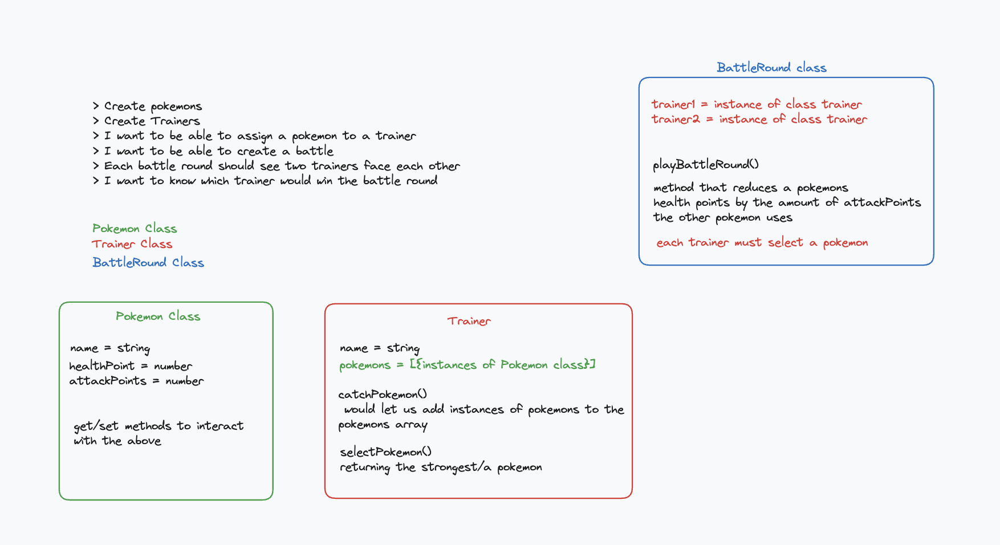

# TDD and Mocking with Jest: 

## Aims of the workshop: 

Covering first learning objective, "Test-drive a simple Javascript program using Node." 

The workshop covers: 
- Unit testing vs integration testing (bit of a refresher from the foundations modules)
- Writing unit and integration tests with Jest
- Mocking using doubles
- Mocking using automatic mocks

It's a bit of a long workshop, usually taking the full 1:30 minutes slot - if anyone has recommendations to shave off some time/optimise the content, they are welcome! 

[Here's a link to finished code I wrote during one of these sessions](https://github.com/ClaireMakers/tdd-jest-workshop-13-mar-24/tree/main)

[And here's a link to the associated recording](https://drive.google.com/drive/u/0/folders/112kXoZF9Sf69TtkHUOMBQK8LzphUX6IB)

## Messaging the students: 

I tend to send the following message for this workshop, alongside the image attached here, as I want the students to prepare a little bit for this workshop. I tend to send it during the afternoon before the workshop, so they have plenty of time to prepare:

----------------------
Good morning! 
Tomorrow morning, I will run a workshop covering TDD using Jest, which will give you a chance to ask some questions about testing as well as general JavaScript features. We will cover:

- Unit testing vs integration testing (bit of a refresher from the foundations modules)
- Writing unit and integration tests with Jest
- Mocking using doubles
- Mocking using automatic mocks

In order to do this, I will be writing a small Pokemon Battle programme, with three classes: Pokemon, Trainer and BattleRound. I have attached the plan I will be following to this message, please take a few minutes to familiarise yourself with it before the workshop at 10:30 in room [room]



---------------------


## Workshop structure: 

### I) Kick-off and definitions: 

Around 5 minutes to introduce people to the objectives of the workshop, and ask them to re-define what unit and integration tests are. This is a re-fresher of the foundations module, and a way to assess where the cohort is at in their understanding of testing.

### II) Unit Tests - TDD the Pokemon Class :

TDDing a very simple pokemon class - the main aim is to remind them of the Jest syntax. Usually students are pretty happy with it and we can get away with a very simple class and tests:

```
const Pokemon = require("./Pokemon");

describe("Unit tests for the Pokemon Class", () => { 
    test("When I call the constructor method, the class is created with a name, healthPoints and attackPoints", () => {
        const pokemon = new Pokemon("Vulpix", 10, 2);
        
        expect(pokemon.attackPoints).toEqual(2);
        expect(pokemon.name).toEqual("Vulpix");
        expect(pokemon.healthPoints).toEqual(10);
    });

    test("The getName() method returns the pokemon name", () => {
        const pokemon = new Pokemon("Vulpix", 10, 2);
        
        expect(pokemon.getName()).toEqual("Vulpix");
    });
})
```

And the Pokemon class itself:

```
class Pokemon {
    constructor(name, healthPoints, attackPoints) { 
        this.name = name;
        this.healthPoints = healthPoints;
        this.attackPoints = attackPoints;
    }

    getName() {
        return this.name;
    }
}
```

I could technically add more methods to interact with these variables, but this is usually sufficient to drive the basics home, and since it's a pretty long workshop, I tend not to spend too much time on this part.

### II) Unit Tests - TDD the Pokemon Trainer Class using doubles for mocking purposes :

Here, the focus should be on how to write unit tests using doubles to mock other classes. I typically TDD the ```catchPokemon()``` method for this particular class: 

```
class Trainer {
  constructor(name) {
    this.name = name;
    this.pokemons = [];
  }

  catchPokemon(pokemon) { 
    this.pokemons.push(pokemon);
  }
}
```

Here's the test I end up writing:

```
describe("unit test for the Trainer class", () => { 
    test("When catchPokemon is called, the argument passed to the function is added to the pokemons array", () => { 
        const ash = new Trainer();

        const doublePokemon = {
            name: "Pikachu",
            healthPoints: 10,
            attackPoints: 2,
            getName: () => { return doublePokemon.name }
        } 

        ash.catchPokemon(doublePokemon); 
        expect(ash.pokemons).toEqual([doublePokemon]);
        expect(ash.pokemons[0].getName()).toEqual("Pikachu");
        expect(ash.pokemons[0]).toBe(doublePokemon)
    })
})

```

One great thing about the double we create here is that it can also be used to hammer home that functions are values like any others in JavaScript, and that they can be assigned to a key in an object, as we can see with ```{ getName: () => { } }```.

### II) BREAK - this is usually a good time to have break:

During the break, I add the ```selectPokemon()``` method from the planning to the Trainer class. When they are back, I explain to the student that I won't have time to TDD it, but it's now there for me to use when writing the Battle class. 

```
  selectPokemon() {
    return this.pokemons[0];
  }
```

### II) Integration Tests - TDD the Battle Class using integration test first:

The main reason why I think it's relevant to first show integration tests with the Battle class is because it makes it easier for them to grasp what will need mocking and why. Showing the integration tests first lets me highlight the dependencies between classes and bring focused attention on them. It also then lets me show the students just how similar the integration and unit tests can sometimes be - one big difference though is whether we are dealing with the real values, or with mocked ones. 

```
const BattleRound = require("./BattleRound");
const Pokemon = require("./Pokemon");
const Trainer = require("./Trainer");


describe("Integration test for BattleRound", () => {
    //two pokemons battling
    //two trainers battling
    //playBattleRound function that will do some maths to figure the winner

    test("When we play a battle round, it should return the pokemon with the most remaining healthPoints", () => { 
        const mew = new Pokemon("Mew", 50, 5); 
        const charmander = new Pokemon("Charmander", 12, 2);

        const ash = new Trainer("Ash");
        const gary = new Trainer("Gary");

        ash.catchPokemon(mew);
        gary.catchPokemon(charmander); 

        const battleRoundOne = new BattleRound(ash, gary);

        expect(battleRoundOne.playBattleRound()).toEqual(mew);
    })
});

```

And the class should look something like this by the end of this section: 

```
class BattleRound {
    constructor(trainer1, trainer2) { 
        this.trainer1 = trainer1;
        this.trainer2 = trainer2; 
    };

    playBattleRound() { 
        const pokemon1 = this.trainer1.selectPokemon();
        const pokemon2 = this.trainer2.selectPokemon();
        pokemon1.healthPoints = pokemon1.healthPoints - pokemon2.attackPoints;
        pokemon2.healthPoints = pokemon2.healthPoints - pokemon1.attackPoints;

        if (pokemon1.healthPoints > pokemon2.healthPoints)
            return pokemon1; 
        else
            return pokemon2; 
    }
}
```

### II) Unit Tests - Write the unit tests for the battle class using automatic mocks:

In order to write these tests, I simply copy and paste what's on (this pill)[https://journey.makers.tech/pages/pill-mocking-with-jest] in the "how to use automatic Jest mocks" section of the material. I also tend to show them the Jest docs at this point as well, and tell them that sometimes, copy/pasting and adapting code that you know works is a valid way to learn, whether it comes directly from the docs, or another reputable source. 


Here's the solution once the code is converted to our BattleRound case - as you can see, we use a mix of double pokemons, and automatic mocks for the Trainer class. 

```
const BattleRound = require("./BattleRound");
const Trainer = require("./Trainer");

jest.mock("./Trainer");

describe("BattleRound unit tests", () => {
  beforeEach(() => {
    // Before each test, reset the mock
    // This helps starting each test case
    // with a "fresh" mocked class
    Trainer.mockClear();
  });
    
    
    test("When we play a battle round, it should return the pokemon with the most remaining healthPoints", () => {
        const doublePokemon1 = {
            attackPoints: 3,
            healthPoints: 10
        }

        const doublePokemon2 = {
          attackPoints: 5,
          healthPoints: 30,
        };

    // 1. We use the normal constructor - Jest will take care of creating a mock.
        const mockTrainer1 = new Trainer();
        const mockTrainer2 = new Trainer(); 

    // 2. We mock the method getMove, replacing its normal implementation
      // selectPokemon
        mockTrainer1.selectPokemon.mockImplementation(() => { return doublePokemon1; });
        mockTrainer2.selectPokemon.mockImplementation(() => {return doublePokemon2; });

    // 3. The rest is the same as when using the previous technique.
        const battleRound = new BattleRound(mockTrainer1, mockTrainer2);

        expect(battleRound.playBattleRound()).toBe(doublePokemon2);
  });
});

```


After that, it's a wrap, all the objectives have been covered in the workshop! 

Let me know if you've found this useful, or what you think about this sort of workshop format - I'm hoping to keep building on this, and maybe making further changes. We used to have more emphasis on mocking and testing with Jest in the past, when the second week was spent building an OOP programme using webpack, but now we spend less time on it, so over time, this workshop might become less relevant and we might choose to spend time on other things instead. 